# Data Flow Diagram — JSN-SR04T Water Level Monitoring System

## Two-System Flow with Processes, Decisions, and Logic

---

## Option 1: Mermaid Diagram (paste into GitHub, Mermaid Live Editor, or Notion)

```mermaid
flowchart TD
    %% ═══════════════════════════════════════════════════════
    %% SYSTEM BOUNDARY: DEVICE (Arduino + Sensors + Cellular)
    %% ═══════════════════════════════════════════════════════
    subgraph DEVICE["SYSTEM 1: FIELD DEVICE (Arduino Uno)"]
        direction TB

        %% ─── External Entities (Device side) ───
        SENSOR_RAW[("JSN-SR04T<br/>Waterproof Ultrasonic<br/>IP67 Transducer")]
        
        %% ─── Processes (Device side) ───
        P1["1. READ SENSOR<br/>Every 300,000ms (5 min)<br/>Send 10µs TRIG pulse<br/>Measure ECHO pulse width<br/>Timeout: 30ms (~5m range)"]
        
        P2{"2. VALIDATE READING<br/>duration > 0?<br/>(pulseIn timeout check)"}
        
        P3{"3. FILTER BLIND ZONE<br/>distance >= 25cm?<br/>(JSN-SR04T min range)"}
        
        P4["4. AVERAGE SAMPLES<br/>Collect 5 valid samples<br/>Calculate mean distance"]
        
        P5["5. CALCULATE WATER LEVEL<br/>water_level = FIELD_DEPTH_CM - avg_distance<br/>Clamp: 0 to FIELD_DEPTH_CM"]
        
        CONFIG[("CONFIG STORE<br/>FIELD_DEPTH_CM<br/>ALERT_HIGH_CM (15cm)<br/>ALERT_LOW_CM (2cm)<br/>DEVICE_ID (RF01)<br/>SERVER_URL<br/>ALERT_PHONE (+63...)")]
        
        P6{"6. CHECK ALERT THRESHOLDS<br/>water_level >= HIGH?<br/>OR water_level <= LOW?<br/>(also check battery)"}
        
        P7["7. BUILD JSON PAYLOAD<br/>{<br/>  device_id,<br/>  water_level_cm,<br/>  distance_cm,<br/>  battery_v,<br/>  signal,<br/>  uptime_days,<br/>  alert (if triggered)<br/>}"]
        
        P8["8. INIT GPRS/4G DATA<br/>SIM800L: AT+SAPBR=1,1<br/>Air780E: AT+CGACT=1,1<br/>Wait for IP address"]
        
        P9{"9. PDP ACTIVE?<br/>IP != 0.0.0.0?"}
        
        P10["10. INIT HTTP SERVICE<br/>AT+HTTPINIT<br/>AT+HTTPPARA=URL<br/>AT+HTTPPARA=CONTENT<br/>AT+HTTPDATA (send JSON)<br/>AT+HTTPACTION=1 (POST)"]
        
        P11{"11. HTTP SUCCESS?<br/>Server returns 200/201?"}
        
        P12["12. SMS FALLBACK<br/>Build text alert<br/>AT+CMGS<br/>Send to ALERT_PHONE"]
        
        P13["13. TERMINATE CONNECTION<br/>AT+HTTPTERM<br/>AT+SAPBR=0,1 / AT+CGACT=0,1"]
        
        P14["14. UPDATE LCD<br/>Line 1: Water: XX.X cm<br/>Line 2: Bat: X.XV LTE:XX"]
        
        P15["15. WAIT FOR NEXT CYCLE<br/>delay until 5 min elapsed<br/>Loop back to P1"]
        
        %% ─── Instant Alert Path (interrupts cycle) ───
        P_IMM{"IMMEDIATE ALERT PATH<br/>FIRES AT ANY TIME<br/>If threshold crossed<br/>between cycles"}
        P_IMM_SMS["Send INSTANT SMS<br/>to farmer's phone<br/>Bypasses 5-min schedule"]
    end

    %% ═══════════════════════════════════════════════════════
    %% SYSTEM BOUNDARY: DASHBOARD (Web Server + PHP + MySQL)
    %% ═══════════════════════════════════════════════════════
    subgraph DASHBOARD["SYSTEM 2: WEB DASHBOARD (PHP + MySQL + Chart.js)"]
        direction TB
        
        %% ─── Processes (Dashboard side) ───
        R1["A. RECEIVE HTTP POST<br/>api/reading.php<br/>Method: POST only<br/>Content-Type: application/json"]
        
        R2{"B. VALIDATE INPUT<br/>JSON parseable?<br/>device_id present?<br/>water_level_cm present?"}
        
        R3{"C. VALIDATE DEVICE<br/>Does device_id exist<br/>in devices table?<br/>Is is_active = 1?"}
        
        DEVICES_DB[(DATABASE: devices<br/>device_id PK<br/>name, location<br/>field_depth_cm<br/>alert_high_cm<br/>alert_low_cm<br/>is_active, created_at)]
        
        R4{"D. SERVER-SIDE ALERT CHECK<br/>(Double validation)<br/>water_level >= alert_high_cm?<br/>OR water_level <= alert_low_cm?<br/>OR battery_v < 11.5?<br/>OR water_level < 0?"}
        
        R5["E. INSERT READING<br/>INSERT INTO sensor_readings<br/>  (device_id, water_level_cm,<br/>   distance_cm, battery_v,<br/>   signal_strength, is_alert,<br/>   alert_message, received_at)"]
        
        READINGS_DB[(DATABASE: sensor_readings<br/>reading_id PK AUTO<br/>device_id FK<br/>water_level_cm<br/>distance_cm<br/>battery_v<br/>signal_strength<br/>uptime_days<br/>is_alert<br/>alert_message<br/>received_at)]
        
        R6["F. INSERT ALERT (if triggered)<br/>INSERT INTO alerts<br/>  (device_id, reading_id,<br/>   alert_type, message,<br/>   water_level_cm, battery_v)"]
        
        ALERTS_DB[(DATABASE: alerts<br/>alert_id PK AUTO<br/>device_id FK<br/>reading_id<br/>alert_type ENUM<br/>message<br/>is_acknowledged<br/>acknowledged_by<br/>created_at)]
        
        R7["G. UPDATE DEVICE STATUS<br/>UPDATE devices SET<br/>updated_at = NOW()"]
        
        R8["H. RETURN RESPONSE<br/>{ status: 'ok',<br/>  reading_id: 123,<br/>  is_alert: 0/1,<br/>  alert_message: null }"]
        
        %% ─── Dashboard UI Processes ───
        D1["I. LOAD DASHBOARD<br/>dashboard.php<br/>Query latest reading<br/>for each active device<br/>LEFT JOIN on MAX(received_at)"]
        
        D2["J. RENDER DEVICE CARDS<br/>For each active device:<br/>- Water level bar (% full)<br/>- Distance, Battery, Signal<br/>- Online/Offline status<br/>- Alert banner (if active)"]
        
        D3["K. LOAD CHART DATA<br/>chart_data.php<br/>Query readings where<br/>received_at >= NOW() - 24h<br/>Return JSON for Chart.js"]
        
        D4["L. RENDER 24H CHART<br/>Chart.js line graph<br/>X-axis: time<br/>Y-axis: water level (cm)<br/>One line per device<br/>Colors: RF01=green, RF02=yellow, RF03=blue"]
        
        A1["M. LOAD ALERTS PAGE<br/>alerts.php<br/>Filter: active or all<br/>Query alerts LEFT JOIN<br/>devices ON device_id<br/>ORDER BY created_at DESC"]
        
        A2["N. ACKNOWLEDGE ALERT<br/>User clicks Acknowledge<br/>UPDATE alerts SET<br/>is_acknowledged = 1<br/>acknowledged_by = user_id"]
        
        H1["O. LOAD HISTORY PAGE<br/>history.php<br/>Filters: device, days<br/>Query sensor_readings<br/>WHERE received_at >=<br/>NOW() - interval<br/>ORDER BY received_at DESC<br/>Show chart + table"]
    
        USERS_DB[(DATABASE: users<br/>user_id PK<br/>full_name, email<br/>username, password<br/>role, last_login)]
        
        L1["P. AUTHENTICATION<br/>login.php: verify password_hash<br/>register.php: create user<br/>logout.php: destroy session<br/>session-based auth"]
    end

    %% ═══════════════════════════════════════════════════════
    %% EXTERNAL ENTITIES
    %% ═══════════════════════════════════════════════════════
    FARMER([FARMER / CLIENT<br/>Receives SMS alerts<br/>Views dashboard<br/>Sends SMS commands])
    
    %% ═══════════════════════════════════════════════════════
    %% DATA FLOWS — Device Internal
    %% ═══════════════════════════════════════════════════════
    SENSOR_RAW -->|"Pulse duration (µs)"| P1
    P1 -->|"duration: unsigned long"| P2
    P2 -->|"No echo (0)"| P14
    P2 -->|"Valid echo"| P3
    P3 -->|"< 25cm<br/>Blind zone"| P14
    P3 -->|">= 25cm<br/>Valid distance"| P4
    P4 -->|"avg_distance: float"| P5
    CONFIG -->|"FIELD_DEPTH_CM"| P5
    CONFIG -->|"Thresholds"| P6
    CONFIG -->|"Device config"| P7
    CONFIG -->|"SIM800L: AT+SAPBR<br/>Air780E: AT+CGDCONT"| P8
    CONFIG -->|"SERVER_URL<br/>ALERT_PHONE"| P12
    P5 -->|"water_level: float"| P6
    P6 -->|"Threshold OK"| P7
    P6 -->|"THRESHOLD BREACHED"| P_IMM
    P_IMM -->|"Alert detected"| P7
    P6 -->|"Low battery"| P7
    P7 -->|"JSON string"| P8
    P8 -->|"AT command responses"| P9
    P9 -->|"No IP / timeout"| P12
    P9 -->|"IP obtained"| P10
    P10 -->|"HTTP response<br/>+HTTPACTION: 1,xxx"| P11
    P11 -->|"200/201 OK"| P13
    P11 -->|"4xx/5xx or timeout"| P12
    P12 -->|"SMS sent"| P13
    P13 -->|"Connection closed"| P14
    P14 -->|"Continuous"| P15
    P15 -->|"After 5 min"| P1
    P7 -.->|"Instant SMS trigger"| P_IMM_SMS
    P_IMM_SMS -.->|"SMS"| FARMER

    %% ═══════════════════════════════════════════════════════
    %% DATA FLOWS — Device → Dashboard (HTTP over Cellular)
    %% ═══════════════════════════════════════════════════════
    P10 -->|"=== HTTP POST ===<br/>JSON payload<br/>Over 4G LTE or 2G GPRS"| R1
    
    %% ═══════════════════════════════════════════════════════
    %% DATA FLOWS — Dashboard Internal
    %% ═══════════════════════════════════════════════════════
    R1 -->|"Raw JSON string"| R2
    R2 -->|"Invalid → 400"| R8
    R2 -->|"Valid"| R3
    R3 -->|"Unknown device → 404"| R8
    R3 -->|"Known device"| R4
    DEVICES_DB -->|"alert thresholds"| R4
    R4 -->|"OK"| R5
    R4 -->|"Alert detected"| R5
    R5 -->|"Insert OK<br/>reading_id returned"| R6
    R6 -->|"Alert inserted<br/>(if triggered)"| R7
    R7 -->|"Updated"| R8
    READINGS_DB --> D1
    READINGS_DB --> D3
    READINGS_DB --> H1
    DEVICES_DB --> D1
    DEVICES_DB --> A1
    DEVICES_DB --> D2
    ALERTS_DB --> A1
    ALERTS_DB --> A2
    USERS_DB --> L1

    %% ─── Dashboard UI Flows ───
    D1 -->|"Device array<br/>+ latest readings"| D2
    D3 -->|"JSON: {readings: [...]}"| D4
    A1 -->|"Alert acknowledged"| A2
    H1 -->|"Filtered results"| D4
    L1 -->|"Session"| D1
    L1 --> A1
    L1 --> H1

    %% ═══════════════════════════════════════════════════════
    %% DATA FLOWS — Dashboard → User
    %% ═══════════════════════════════════════════════════════
    D2 -->|"HTML rendered cards"| FARMER
    D4 -->|"Chart.js graph"| FARMER
    A1 -->|"Alert table"| FARMER
    A2 -->|"Updated status"| FARMER
    H1 -->|"History view"| FARMER
    L1 -->|"Login/out pages"| FARMER
    FARMER -->|"SMS commands:<br/>STATUS, LEVEL, BATTERY, HELP"| P12
    
    %% ═══════════════════════════════════════════════════════
    %% STYLING — System 1 (Device)
    %% ═══════════════════════════════════════════════════════
    classDef process fill:#fff3e0,stroke:#e65100,stroke-width:2px,color:#e65100
    classDef decision fill:#ffccbc,stroke:#bf360c,stroke-width:2px,color:#bf360c,font-weight:bold
    classDef store fill:#f5f5f5,stroke:#616161,stroke-width:2px,color:#616161,stroke-dasharray: 5 5
    classDef ext fill:#e3f2fd,stroke:#1565c0,stroke-width:2px,color:#1565c0
    
    class P1,P4,P5,P7,P8,P10,P12,P13,P14,P15 process
    class P2,P3,P6,P9,P11 decision
    class CONFIG store
    class SENSOR_RAW ext

    %% ═══════════════════════════════════════════════════════
    %% STYLING — System 2 (Dashboard)
    %% ═══════════════════════════════════════════════════════
    classDef api fill:#e8f5e9,stroke:#2e7d32,stroke-width:2px,color:#2e7d32
    classDef dash fill:#e8eaf6,stroke:#283593,stroke-width:2px,color:#283593
    classDef db fill:#f3e5f5,stroke:#7b1fa2,stroke-width:2px,color:#7b1fa2,stroke-dasharray: 5 5
    classDef user fill:#fce4ec,stroke:#c62828,stroke-width:2px,color:#c62828
    
    class R1,R5,R6,R7,R8 api
    class R2,R3,R4 decision
    class D1,D2,D3,D4,A1,A2,H1,L1 dash
    class DEVICES_DB,READINGS_DB,ALERTS_DB,USERS_DB db
    class FARMER user
    
    %% ═══════════════════════════════════════════════════════
    %% SYSTEM BOUNDARY BOXES
    %% ═══════════════════════════════════════════════════════
    style DEVICE fill:#fff8e1,stroke:#e65100,stroke-width:3px,color:#e65100
    style DASHBOARD fill:#e8f5e9,stroke:#2e7d32,stroke-width:3px,color:#2e7d32
```



---

## Option 2: Text Prompt (for Lucidchart / draw.io / ChatGPT)

Paste this into any flowchart tool:

```
Create a Data Flow Diagram (DFD) with TWO clearly boxed systems connected by a single arrow labeled "HTTP POST over Cellular (4G LTE or 2G GPRS)".

SYSTEM 1 (left side, orange border) — "FIELD DEVICE (Arduino Uno)":
  External entity: "JSN-SR04T Waterproof Ultrasonic Sensor" (box, light blue)

  Processes (rounded rectangles inside the system):
  
  1. "READ SENSOR" — Fires a 10µs TRIG pulse on D9 every 300,000ms (5 minutes). Measures ECHO pulse width on D10 with 30ms timeout.
  
  2. Decision: "VALIDATION — duration > 0?" (diamond shape). If no echo (timeout), skip to LCD update. If valid, proceed.
  
  3. Decision: "BLIND ZONE CHECK — distance >= 25cm?" (diamond). If below 25cm (JSN-SR04T minimum range), skip reading. If valid, proceed.
  
  4. "AVERAGE SAMPLES" — Collects 5 valid distance readings, calculates mean.
  
  5. "CALCULATE WATER LEVEL" — Formula: water_level = FIELD_DEPTH_CM - avg_distance. Clamped between 0 and FIELD_DEPTH_CM.
  
  6. Data store: "CONFIGURATION" (open-ended rectangle) — contains FIELD_DEPTH_CM, ALERT_HIGH_CM (15cm), ALERT_LOW_CM (2cm), DEVICE_ID, SERVER_URL, ALERT_PHONE.
  
  7. Decision: "CHECK THRESHOLDS" (diamond) — water_level >= HIGH? OR water_level <= LOW? OR battery < critical? 
     - If YES: trigger "IMMEDIATE ALERT PATH" which sends instant SMS bypassing the 5-min schedule.
     - Either way, proceed to build payload.
  
  8. "BUILD JSON PAYLOAD" — Creates { device_id, water_level_cm, distance_cm, battery_v, signal, uptime_days, alert (if triggered) }.
  
  9. "INIT CELLULAR DATA" — SIM800L path: AT+CGATT=1, AT+SAPBR=3,1,"APN", AT+SAPBR=1,1. Air780E path: AT+CGDCONT=1,"IP","apn", AT+CGACT=1,1.
  
  10. Decision: "PDP ACTIVE? — IP != 0.0.0.0?" (diamond). If no IP, go to SMS fallback.
  
  11. "HTTP POST" — AT+HTTPINIT, AT+HTTPPARA=URL, AT+HTTPPARA=CONTENT, AT+HTTPDATA (send JSON), AT+HTTPACTION=1.
  
  12. Decision: "HTTP SUCCESS? — Server returns 200/201?" (diamond). If yes, terminate connection. If no, go to SMS fallback.
  
  13. "SMS FALLBACK" — Build text message, send via AT+CMGS to ALERT_PHONE.
  
  14. "TERMINATE CONNECTION" — AT+HTTPTERM, AT+SAPBR=0,1 or AT+CGACT=0,1.
  
  15. "UPDATE LCD" — Display Water Level, Battery Voltage, Signal Strength.
  
  16. "WAIT FOR NEXT CYCLE" — Loop back to step 1 every 5 minutes.

  Arrow from STEP 11 labeled "HTTP POST" exits SYSTEM 1, crosses to SYSTEM 2.

SYSTEM 2 (right side, green border) — "WEB DASHBOARD (PHP + MySQL + Chart.js)":

  Processes:
  
  A. "RECEIVE HTTP POST" — api/reading.php. Accepts POST only. Reads JSON from php://input.
  
  B. Decision: "VALIDATE INPUT" (diamond) — JSON parseable? device_id present? water_level_cm present? If invalid, return 400 error.
  
  C. Decision: "VALIDATE DEVICE" (diamond) — Does device_id exist in devices table? Is it active? If not, return 404 error.
  
  D. Decision: "SERVER-SIDE ALERT CHECK" (diamond) — Double-validation of water_level against thresholds from device config. Also checks battery voltage.
  
  E. "INSERT READING" — INSERT INTO sensor_readings table (device_id, water_level_cm, distance_cm, battery_v, signal_strength, is_alert, alert_message).
  
  F. "INSERT ALERT (if triggered)" — INSERT INTO alerts table (device_id, reading_id, alert_type, message, water_level_cm, battery_v).
  
  G. "UPDATE DEVICE STATUS" — UPDATE devices SET updated_at = NOW().
  
  H. "RETURN RESPONSE" — JSON { status: "ok", reading_id, is_alert, alert_message }.
  
  Data stores (open-ended rectangles, purple):
    - "devices table" — device_id, name, location, field_depth_cm, alert_high_cm, alert_low_cm, is_active
    - "sensor_readings table" — reading_id, device_id, water_level_cm, distance_cm, battery_v, signal_strength, uptime_days, is_alert, alert_message, received_at
    - "alerts table" — alert_id, device_id, reading_id, alert_type, message, water_level_cm, battery_v, is_acknowledged, acknowledged_by, created_at
    - "users table" — user_id, full_name, email, username, password_hash, role, last_login
  
  Dashboard UI processes:
  
  I. "LOAD DASHBOARD" — dashboard.php. Queries latest reading for each active device (LEFT JOIN on MAX(received_at)).
  
  J. "RENDER DEVICE CARDS" — For each device: water level bar (filled percentage), distance, battery voltage with color coding, signal/31, online/offline status (minutes since last reading), alert banner if triggered.
  
  K. "LOAD CHART DATA" — chart_data.php. Queries readings where received_at >= NOW() - 24 hours, returns JSON.
  
  L. "RENDER 24H CHART" — Chart.js line graph. X-axis = time (hour intervals). Y-axis = water level (cm). One line per device (RF01=green, RF02=yellow, RF03=blue).
  
  M. "LOAD ALERTS PAGE" — alerts.php. Lists active or all alerts. Table shows: device, alert type badge, message, location, water level, battery, time, acknowledge button.
  
  N. "ACKNOWLEDGE ALERT" — User clicks acknowledge. UPDATE alerts SET is_acknowledged=1, acknowledged_by=user_id.
  
  O. "LOAD HISTORY PAGE" — history.php. Filters by device (dropdown) and period (24h, 3d, 7d, 14d, 30d). Shows chart + data table.
  
  P. "AUTHENTICATION" — login.php (verify password_hash), register.php (create user with hashed password), logout.php (destroy session). Session-based auth with user roles.

External entity (rightmost, red): "FARMER / CLIENT" — Receives SMS alerts on phone. Views dashboard via web browser. Sends SMS commands (STATUS, LEVEL, BATTERY, HELP) which are received by the device.

Arrows:
  - Device → Dashboard: "HTTP POST over Cellular" (thick arrow, labeled with JSON structure)
  - Dashboard → Farmer: Multiple arrows labeled "HTML pages (dashboard, alerts, history)" and "Chart.js graph"
  - Farmer → Device: "SMS Commands" (dashed arrow, labeled "STATUS/LEVEL/BATTERY/HELP")
  - Device → Farmer: "SMS Alerts" (dashed arrow, red, labeled "Instant SMS on threshold breach")

Color scheme:
  - SYSTEM 1 border: Orange (#e65100), background: light orange (#fff8e1)
  - SYSTEM 2 border: Green (#2e7d32), background: light green (#e8f5e9)
  - Processes (device): Orange shapes
  - Decisions (device): Dark orange diamonds with bold text
  - API endpoints: Green rounded rectangles
  - Dashboard UI: Blue rounded rectangles
  - Databases: Purple dashed-border rectangles
  - External entities: Light blue (sensor) / red (farmer)
  - Data stores: Gray dashed rectangles
```

---

## How to Use

**For Mermaid** — paste the code block into:
- [mermaid.live](https://mermaid.live) (free online editor)
- GitHub .md files (GitHub renders Mermaid natively)
- Notion (paste into a code block, select Mermaid)
- Obsidian (with Mermaid plugin)

**For Text Prompt** — copy the text and paste into:
- Lucidchart AI image generator
- draw.io (File → Import → From text)
- ChatGPT / Claude with "draw a flowchart from this description"
- Any AI diagramming tool
